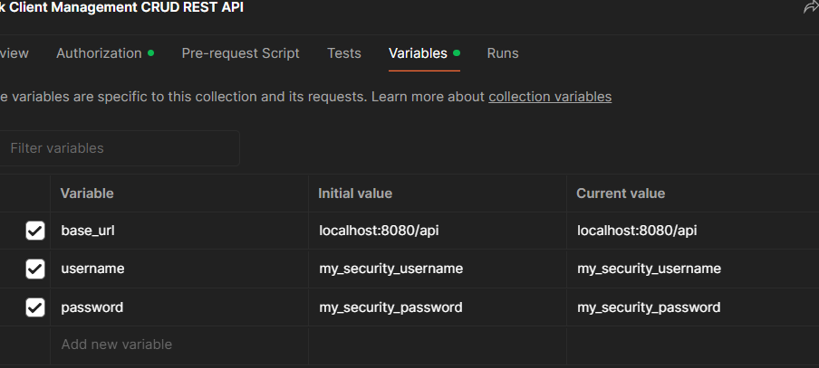

# Bank client management
This is a simple CRUD with SpringBoot + Java 11 + PostgreSQL. Initial bank client management.

# Author
- Jesus Caraballo Luna

# Requirements
- Java 11
- Maven
- PostgreSQL
- Git
- Docker
- Postman

# Simple Development Guide
## Before to start
```sh
  # Clone
  $ git clone https://github.com/jesucluna/bank-client-management.git
  $ cd bank-client-management
```
After that, we need to configure our credentials for postgreSQL and Spring security in [docker-compose.yml](/docker-compose.yml). Changing credentials below by yours.

```sh
      POSTGRES_USER: my_user
      POSTGRES_PASSWORD: my_password
      
      SPRING_DATASOURCE_USERNAME: my_user
      SPRING_DATASOURCE_PASSWORD: my_password
      SECURITY_ADMIN_USERNAME: my_security_username
      SECURITY_ADMIN_PASSWORD: my_security_password
```


## Docker instructions
### 1. Run and update
```sh
  # Create an image and container with compose
  $ docker-compose up
```   

## Postman
When application is up import [Postman Collection CRUD](/Bank%20Client%20Management%20CRUD%20REST%20API.postman_collection.json) into your Postman application and configure global variables



Make sure `username` and `password` be the same of configured in "Before to start section".

# Simple Change log
## [1.0.0]
- Initial commit.
- Added initial structure, common, config, error and constant files.
- Added CRUD for Clients.
- Added SpringDoc for API documentation.
- Added GuardClauses and configured [ControllerExceptionHandler](/src/main/java/com/integration/bank_client_management/errors/ControllerExceptionHandler.java).

## [1.1.0]
- Added [BasicSecurityConfig](/src/main/java/com/integration/bank_client_management/config/BasicSecurityConfig.java), [BasicAuthenticationEntryPoint](/src/main/java/com/integration/bank_client_management/security/BasicAuthenticationEntryPoint.java).
- Defined correctly env variables for db and api security.

## [1.1.1]
- Added [Postman Collection CRUD](/Bank%20Client%20Management%20CRUD%20REST%20API.postman_collection.json). 
- Added Logging setting for saving logs.
- Edited gitignore in order to ignore application log files

## [1.1.2]
- Added [Dockerfile](/Dockerfile) and [docker-compose.yml](/docker-compose.yml)
- Added seed data in init.sql.
- Described README.md, instructions and simple change log with commit history log.
- Added JDBC dependency and edited application properties for docker-compose env variables.
